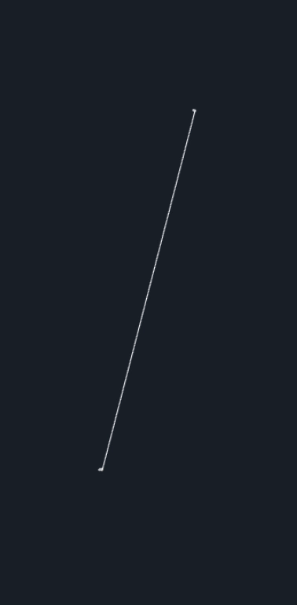

# Strange Cipher
An encryption/decryption algorithm based on Lorenz's Strange Attractor, and WebSockets for communication.

## How it Works

Both the server and the client have a running Lorenz Strange Attractor.  
The Attractors have the same pre-conditions, but each starts at different positions in space, resulting in vastly different trajectories.  
The basic idea is:  
```
Attractors with different trajectories -> sync them -> create a stream cipher on the server and client -> encrypt with client cipher -> send encrypted message -> decrypt with server cipher -> desync the Attractors
```

The stream cipher is constructed with the current `y` coordinate of the Attractor at each frame.  
Because the attractors are synced, the `y` coordinates should be the same, and so the server can decrypt the message.

The whole process takes about 20-45ms.  

But how can we sync these seemingly chaotic systems?

### Syncing Process

Steven Strogatz described, in 2003, an easy way of syncing two or more chaotic systems:
- Take one of the Systems, the `Driver`, that will transmit its current state in a one-way communication tunnel.
- The other system becomes the `Reciever`.
- If we force the `Reciever`'s `x` coordinate to be equal to the `x` coordinate from the `Driver` system, we observe that, after a small number of iterations, the systems become synced



In this example, the bottom Attractor, the `Reciever`, struggles to display the normal Butterfly-like behavior at first, but then, after a few seconds, for each new point the other coordinates start coming
closer and closer to the `Driver` Attractor, until they are, in Steven Strogatz’s words, dancing in perfect sync with their doppelgänger.  

This implementation defines the Attractor on the client side as the `Driver` and the server side as the `Reciever`.

### Why are Chaotic Attractors Good for Cryptography?

- They are **Deterministic**, meaning that, given the same pre-conditions, the outcome will always be the same.  
- They are also very sensitive to those pre-conditions. The smallest of changes means a **huge** difference in the outcome, which is one of the why they are called chaotic (the other is that it is hard to predict what will happen next). This quality makes it worthwhile, because it means we can create secure ciphers.

## Running

Run the server:
```bash
cargo run --bin server
```

And the client:
```bash
cargo run --bin client
```

in separate terminal windows, write something on the client, and watch it get encoded on the client and decoded on the server.

## Testing

Run the tests with the command:
```bash
cargo test
```

The testing suite is made up of:
- [ ] Unit Tests
  - [x] Encryption function
  - [x] Decryption function
  - [ ] Lorenz Attractor Syncing

- [x] Integration Tests
  - [x] 100 Non-Concurrent Clients
  - [x] 100 Concurrent Clients

## Future Work
- [ ] Client Verification with Keys
- [ ] Server and Client Agreement on Different Pre-Conditions
- [ ] Two-way Encryption/Decryption
- [ ] Add more Attractors and a way for the Server and Client to reach a consensus on which one to use

## Security Considerations

Please note that I did not formally prove this algorithm.  
It may not be suitable for real-world applications, as it may contain security concerns and/or not be 100% accurate all of the time.

## Bibliography
These papers were a big inspiration for this project:

- **A Chaos Based Encryption Method Using Dynamical Systems with Strange Attractors** ([**Link**](https://arxiv.org/abs/1201.3114))
  - **Authors:** Arash Sheikholeslam
  - **Journal:** SECRYPT. 2009
    
- **Fast, parallel and secure cryptography algorithm using Lorenz's attractor** ([**Link**](https://arxiv.org/abs/1201.3114))
  - **Authors:** Anderson Gonçalves Marco, Alexandre Souto Martinez, Odemir Martinez Bruno
  - **Journal:** International Journal of Modern Physics C, Volume: 21, Issue: 3(2010) pp. 365-382

## Credits

- **Syncing GIF**
  - **Author:** Iacopo Garizio
  - **Website**: [Synchronizing Lorenz attractors I](https://iacopogarizio.com/projects/synchronizing-lorenz-attractors-i)
